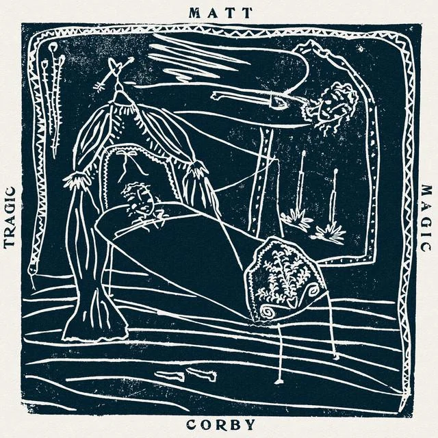

## <iframe data-testid="embed-iframe" style="border-radius:12px" src="https://open.spotify.com/embed/playlist/1Yzgz0PUVlIXRvYyjxkHNY?utm_source=generator&theme=0" width="100%" height="352" frameBorder="0" allowfullscreen="" allow="autoplay; clipboard-write; encrypted-media; fullscreen; picture-in-picture" loading="lazy"></iframe>

---

## Gia Margaret - Singing

_Tasting Notes: A master of ambient works finds her voice again after 8 years!_

Losing her voice after her 2018 tour, Gia Margaret pivoted to creating some of the most beautiful ambient piano and synth works my ears have ever been blessed with. Her 2020 album "Mia Gargaret" included these powerful little voice recordings of her working with a vocal coach and trying to regain strength. Then "Romantic Piano" continued to solidify her as a master-craftswoman of telling stories through her instruments.

Her album "Singing" is all the better for the detour her life took with these ambient works. Now, with full voice restored, she is in full control of her sound, her voice, her lyrics.

During the lead-up to this album, I couldn't have been more excited by her two singles, "Everyone Around Me Dancing" and "Good Friend". The first neatly lands in the familiar soundscape of her previous works, with contemplative open-air piano and whispery vocals. Then, "Good Friend" shocked me! A beautiful upbeat, danceable track with some Sitar/Indian music flourishes.

Also, is that a secret Bill Callahan cameo I hear on Cellular Reverse!?

---

## Quiet Light - Blue Angel Sparkling Silver 2

_Tasting Notes: Reading your high school journal while your maestro friend whips up synthy soundscapes beside you._

Austin, Texas native and CURRENT MED STUDENT, Riya Mahesh, aka Quiet Light, pulls together a mixtape-esque album filled to the brim with youthful musings and spacious synth soundscapes. I specifically enjoy her percussive choices on tracks like Berlin and Star100. She sometimes leaves an entire track to float without a rhythmic component, or, in other moments, surprises with tight, punchy snares that will surely get your head bobbing.

---

## Loukeman - Sd-3

_Tasting Notes: 2020 Soundcloud's best-kept secret_

Toronto producer Luke "Loukeman" completes his Sd trilogy today with Sd-3. The variety of electronic music genres he puts on display in this album is a feat unto itself. One minute you're packing your bags to go hit up the club with dance bops like "To The Sky", next minute you're curled up in the fetal position getting introspective to downtempo "U love it". You'll definitely be hearing his beats on some of your favorite artists' albums in the future.

---

## Matt Corby - Tragic Magic

_Tasting Notes: Funky-fresh sun rays injected straight into your cubital vein._

Ok ok, I'm a week late, but I've been enjoying this album a ton since then, and it's worth a share! Matt Corby's fourth full-length album places his multi-instrumental wizardry squarely in the funkadelic camp. Punchy bass line, crispy drums, moog lead lines that'll make you do that stanky face, and of course, some of my favorite vocal performances of 2026. All of this instrumentation complements his lyrics so well as he tackles fatherhood, husbandry (both in the marriage sense and his caring for his "Rainbow Valley" ranch), and personal health.
