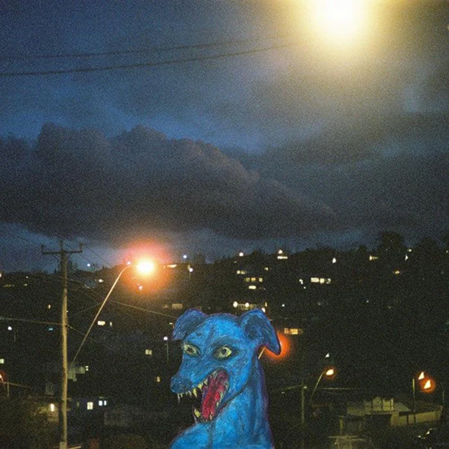
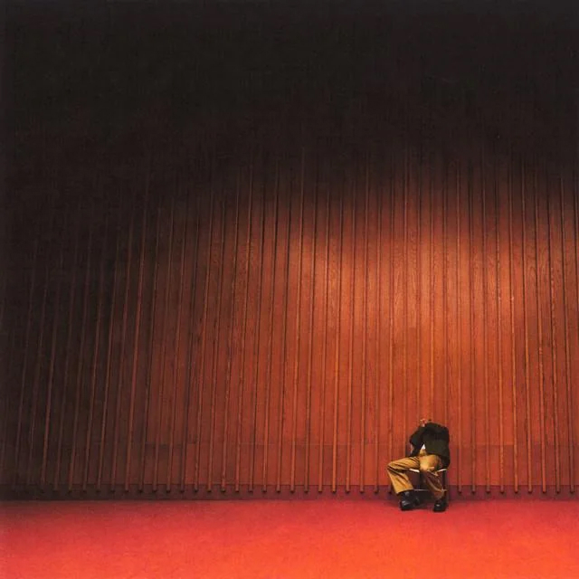
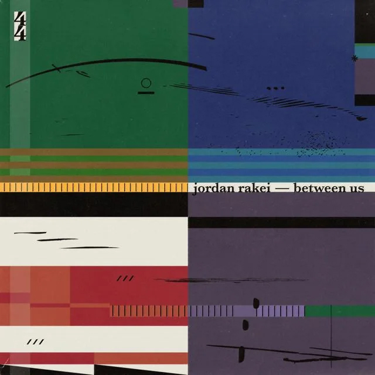

## <iframe style="border-radius:12px" src="https://open.spotify.com/embed/playlist/2I2jPLrm3r25q4qfvVSgLA?utm_source=generator&theme=0" width="100%" height="352" frameBorder="0" allowfullscreen="" allow="autoplay; clipboard-write; encrypted-media; fullscreen; picture-in-picture" loading="lazy"></iframe>

---

## Divers - Odd Dog in the Capital

Releasing their insanely fun indie rock debut album, Divers, drops onto the music scene fully formed and ready to rock your socks off. A guitar-driven, slightly electronic sound harkens to the best of Cage the Elephant or even a touch of Youth Lagoon.

Songs like “The Great Tree” combine their ability to build serious hooks with their own off-center humor, Like when their song gets cut off halfway through so that The Great Tree himself can speak for a second, “uhhhh that was weird,” they say, then get back to the song. It reminds me of Geese’s 3D Country, where they’d take the trappings of a serious radio hit and then throw in some absolutely wild interlude just because it made them laugh.

I have a feeling I’ll be playing this album all summer.

---

## Isaiah Rashad - IT’S BEEN AWFUL

The all-caps album title helps prepare us for the long-awaited, much-anticipated 3rd studio (first in five years) album from Chattanooga rapper Isaiah Rashad. He is in total control of his craft on this album, mixing R\&B, pop, and southern rap. The hybrid style and change of pace work so well, especially on tracks like BOY IN READ with a pitch-perfect feature from SZA, but he’s also making tracks “For his big brothers,” as he puts it. The TLDR of this album is: this man can’t miss.

---

## Jordan Rakei - Between Us

A week late and a dollar short, AGAIN! This one snuck past me, but it hit me hard enough this week that I had to bring it up. Jordan Rakei and his collaborators bring a raucously joyous jazz/soul EP that deserves your attention.

While working as the first artist-in-residence at the famed Abbey Road studios, Jordan was able to experiment with many artists passing through the hallowed halls. After exiting his residency, he rounded up some of those players and created this EP, putting all that play and experimentation on display.

The performances by everyone contributing to this effort are sublime. I especially love the instrumentation on Easy to Love with a jazz-flute performance that’d make Ron Burgundy blush\!
