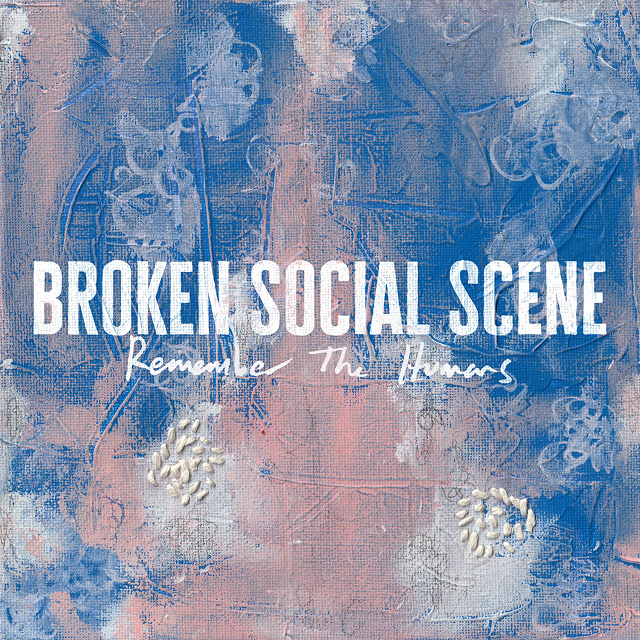

## <iframe style="border-radius:12px" src="https://open.spotify.com/embed/playlist/1UxGSA2vNRIC4Dtp1ckC6B?utm_source=generator&theme=0" width="100%" height="352" frameBorder="0" allowfullscreen="" allow="autoplay; clipboard-write; encrypted-media; fullscreen; picture-in-picture" loading="lazy"></iframe>

---

## Broken Social Scene - Remember the Humans

_Tasting Notes: A group of way too many friends brought ALL their instruments to a jam-sess for catharsis._

“There’s no need to cry here anymore… I guess it’s colder times.” Broken Social Scene opens their latest record with a surprisingly grounded, optimistic light. Returning after a near-10-year hiatus, this sprawling, ever-rotating collective of multi-instrumental Canucks proves their sound is as present and prescient as ever. As the title implies, Remember the Humans physically pulls you in and lifts your gaze back to the people around you. It arrives right when we need it most.

---

## Basement - WIRED

_Tasting Notes: Nostalgic dad rock that’s heavy but not TOO heavy._

Returning after a lengthy break, British rockers Basement continue to demonstrate their mastery of early-2000s post-hardcore without sounding trapped in the past. Longtime fans shouldn't fret; the driving guitar work is still front and center, but it's now paired with a new atmospheric openness, with wider mixing and more space between the heavy riffs.

It is a thrill to watch a band with such a distinct sound find a path forward that relies on growth in degrees rather than total reinvention.

---

## Black Milk - CEREMONIAL

_Tasting Notes: Uh, he got to work with J Dilla. What else do you need to know?_

Detroit rapper Black Milk returns to his signature melodic hip-hop, laying mellow, heartfelt bars over live, jazz-infused beats. CEREMONIAL finds him wrestling with the realities of fame and the effort it takes to stay grounded within his community. On the track “Crash Test Dummy,” he ironically notes: “No thoughts about the slumps, funds only, no trauma dumps / The most therapeutic feeling watching those commas come.” It's a poignant reflection from an artist who spent his youth chasing fortune, only to realize he wants something more for the next generation. He uses features sparingly but to great effect, climaxing on the album’s closer with BJ the Chicago Kid and Chris Solar’s stellar guitar work.

---

## Lykke Li - The Afterparty

_Tasting Notes: Being in your feelings, but you’ve already committed to going out on the town with your friends._

Are you experiencing feelings of revenge, shame, or despair, but still want to dance your heart out? Lykke Li has you covered. The Swedish pop auteur brings us what she claims is her final album, and for our sake, let's hope she changes her mind. On The Afterparty, Li explores what she calls “the lower self”, or the darkest aspects of our human nature. I love the contrast. Her brief, 24-minute record is loaded with moments that disguise heavy, emotional wreckage as absolute pop bangers. The production is both impeccable and wild, recorded in Sweden with a 17-piece orchestra that delivers a fully cinematic listen.

By sampling composer Max Richter on “Lucky Again,” she proves this record is far more profound than a candy-coated dancehall playlist.
